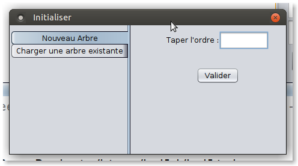
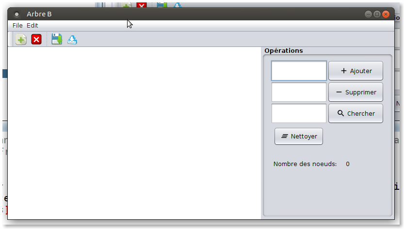
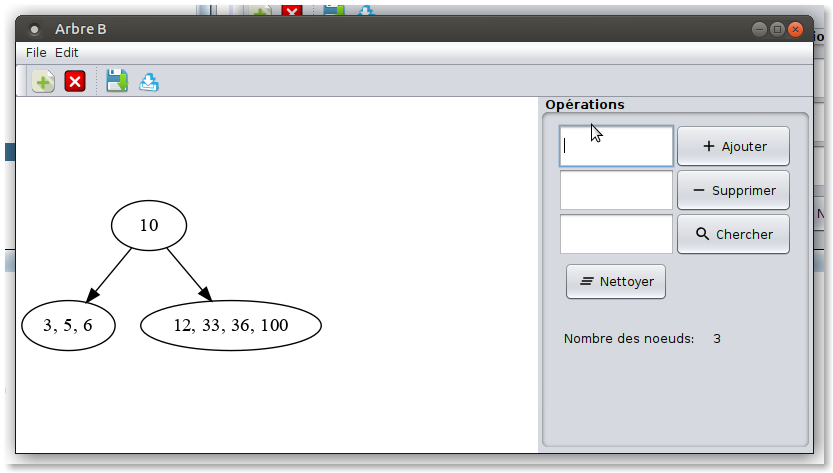
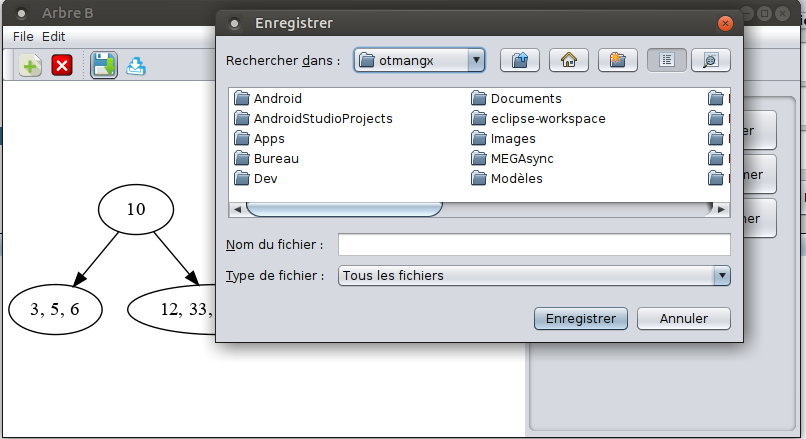

## GxBtree version 0.1
GxBtree is a B-tree gui implementation on java. 

It uses **graphviz** to visualize graphs.

You should install **graphviz** in your system to make it working.

The current version support :\
    -Add/remove nodes.\
    -Search a node.\
    -Save/Load the work.

